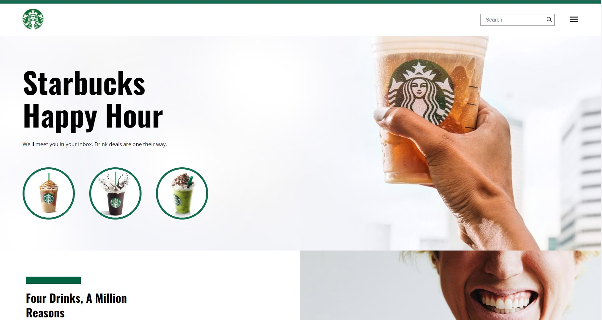
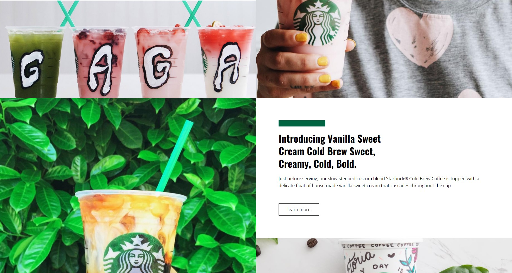
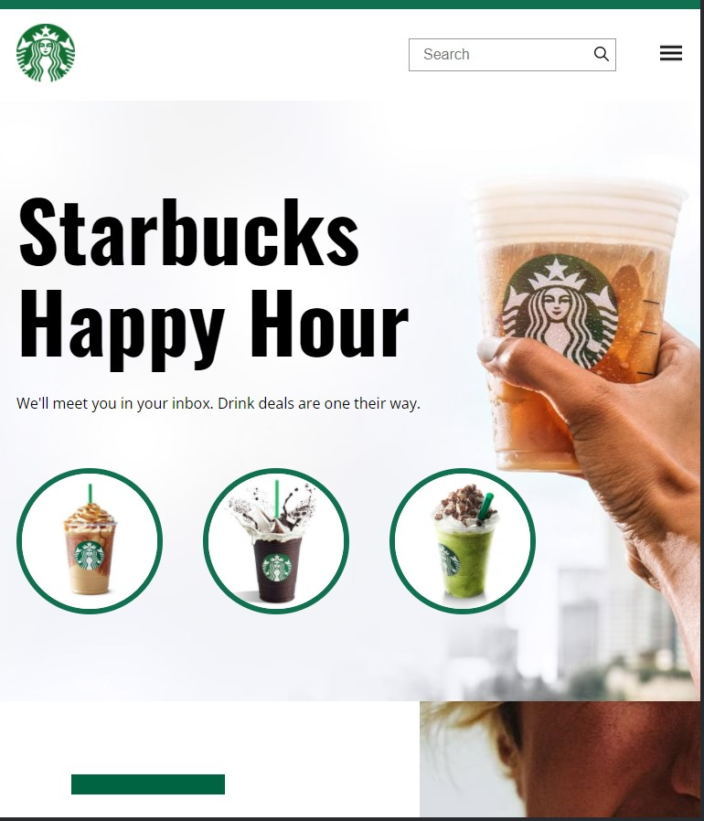

<h1>PROJETO SITE STARBUCKS</h1>
<h3>Desenvolvi este site com fins de estudo, pela plataforma B7Web :confetti_ball:</h3>
<h3>Realizei a criação deste site a partir do ORIGINAL todos os direitos do template pertencem a Nice Page. A utilização é exclusivamente para fins de aprendizagem para exercitar meus conhecimentos em HTML e CSS.</h3> 

:heavy_check_mark: Template criado usando CSS-Grid e Flexbox

:heavy_check_mark: Totalmente responsivo.

 <h3>Visualize o projeto no link <a href="https://animated-elf-655377.netlify.app/" target="_blank">  :arrow_right: Prévia publicada :arrow_left:</a></h3> 

  
Versão Desktop:  
  

  
Versão Mobilie (tablet e celular): 
  

